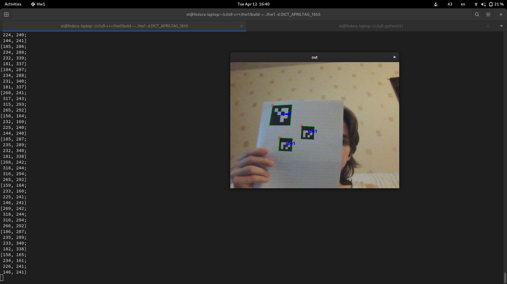

# Цели

На примере задачи распознавания ArUco маркеров разобраться с установкой библиотеки OpenCV и изучить примеры ее использования на языке С++

# Задачи

- Сборка OpenCV для C++
- Реализовать пример `detect_markers.cpp`.
- Реализовать вывод координат углов ArUco меток в консоль.
- Реализовать вывод координат углов ArUco меток в формате `JSON`.

# Решение

## Скриншот работы с выводом меток в терминал


## `meson.build`

```meson
project('hw1', 'cpp',
  version : '0.1',
  default_options : ['warning_level=3', 'cpp_std=c++17'])

opencvdep = dependency('opencv4')

executable('hw1',
           'detect_markers.cpp',
           install : true,
           dependencies : opencvdep
           )

run_target('run',
           command : './run.sh')
```

## `run.sh`

```sh
#!/usr/bin/env bash

LD_LIBRARY_PATH=/usr/local/lib:/usr/local/lib64/ ./hw1 -d DICT_APRILTAG_16h5
```

## `detect_markers.cpp`

```cpp
/*
By downloading, copying, installing or using the software you agree to this
license. If you do not agree to this license, do not download, install,
copy or use the software.

                          License Agreement
               For Open Source Computer Vision Library
                       (3-clause BSD License)

Copyright (C) 2013, OpenCV Foundation, all rights reserved.
Third party copyrights are property of their respective owners.

Redistribution and use in source and binary forms, with or without modification,
are permitted provided that the following conditions are met:

  * Redistributions of source code must retain the above copyright notice,
    this list of conditions and the following disclaimer.

  * Redistributions in binary form must reproduce the above copyright notice,
    this list of conditions and the following disclaimer in the documentation
    and/or other materials provided with the distribution.

  * Neither the names of the copyright holders nor the names of the contributors
    may be used to endorse or promote products derived from this software
    without specific prior written permission.

This software is provided by the copyright holders and contributors "as is" and
any express or implied warranties, including, but not limited to, the implied
warranties of merchantability and fitness for a particular purpose are
disclaimed. In no event shall copyright holders or contributors be liable for
any direct, indirect, incidental, special, exemplary, or consequential damages
(including, but not limited to, procurement of substitute goods or services;
loss of use, data, or profits; or business interruption) however caused
and on any theory of liability, whether in contract, strict liability,
or tort (including negligence or otherwise) arising in any way out of
the use of this software, even if advised of the possibility of such damage.
*/


#include <opencv2/highgui.hpp>
#include <opencv2/aruco.hpp>
#include <iostream>
#include "aruco_samples_utility.hpp"

using namespace std;
using namespace cv;

namespace {
const char* about = "Basic marker detection";

//! [aruco_detect_markers_keys]
const char* keys  =
        "{d        |       | dictionary: DICT_4X4_50=0, DICT_4X4_100=1, DICT_4X4_250=2,"
        "DICT_4X4_1000=3, DICT_5X5_50=4, DICT_5X5_100=5, DICT_5X5_250=6, DICT_5X5_1000=7, "
        "DICT_6X6_50=8, DICT_6X6_100=9, DICT_6X6_250=10, DICT_6X6_1000=11, DICT_7X7_50=12,"
        "DICT_7X7_100=13, DICT_7X7_250=14, DICT_7X7_1000=15, DICT_ARUCO_ORIGINAL = 16,"
        "DICT_APRILTAG_16h5=17, DICT_APRILTAG_25h9=18, DICT_APRILTAG_36h10=19, DICT_APRILTAG_36h11=20}"
        "{cd       |       | Input file with custom dictionary }"
        "{v        |       | Input from video or image file, if ommited, input comes from camera }"
        "{ci       | 0     | Camera id if input doesnt come from video (-v) }"
        "{c        |       | Camera intrinsic parameters. Needed for camera pose }"
        "{l        | 0.1   | Marker side length (in meters). Needed for correct scale in camera pose }"
        "{dp       |       | File of marker detector parameters }"
        "{r        |       | show rejected candidates too }"
        "{refine   |       | Corner refinement: CORNER_REFINE_NONE=0, CORNER_REFINE_SUBPIX=1,"
        "CORNER_REFINE_CONTOUR=2, CORNER_REFINE_APRILTAG=3}";
}
//! [aruco_detect_markers_keys]

int main(int argc, char *argv[]) {
    CommandLineParser parser(argc, argv, keys);
    parser.about(about);

    if(argc < 2) {
        parser.printMessage();
        return 0;
    }

    bool showRejected = parser.has("r");
    bool estimatePose = parser.has("c");
    float markerLength = parser.get<float>("l");

    Ptr<aruco::DetectorParameters> detectorParams = aruco::DetectorParameters::create();
    if(parser.has("dp")) {
        FileStorage fs(parser.get<string>("dp"), FileStorage::READ);
        bool readOk = aruco::DetectorParameters::readDetectorParameters(fs.root(), detectorParams);
        if(!readOk) {
            cerr << "Invalid detector parameters file" << endl;
            return 0;
        }
    }

    if (parser.has("refine")) {
        //override cornerRefinementMethod read from config file
        detectorParams->cornerRefinementMethod = parser.get<int>("refine");
    }
    std::cout << "Corner refinement method (0: None, 1: Subpixel, 2:contour, 3: AprilTag 2): " << detectorParams->cornerRefinementMethod << std::endl;

    int camId = parser.get<int>("ci");

    String video;
    if(parser.has("v")) {
        video = parser.get<String>("v");
    }

    if(!parser.check()) {
        parser.printErrors();
        return 0;
    }

    Ptr<aruco::Dictionary> dictionary;
    if (parser.has("d")) {
        int dictionaryId = parser.get<int>("d");
        dictionary = aruco::getPredefinedDictionary(aruco::PREDEFINED_DICTIONARY_NAME(dictionaryId));
    }
    else if (parser.has("cd")) {
        FileStorage fs(parser.get<std::string>("cd"), FileStorage::READ);
        bool readOk = aruco::Dictionary::readDictionary(fs.root(), dictionary);
        if(!readOk) {
            std::cerr << "Invalid dictionary file" << std::endl;
            return 0;
        }
    }
    else {
        std::cerr << "Dictionary not specified" << std::endl;
        return 0;
    }

    Mat camMatrix, distCoeffs;
    if(estimatePose) {
        bool readOk = readCameraParameters(parser.get<string>("c"), camMatrix, distCoeffs);
        if(!readOk) {
            cerr << "Invalid camera file" << endl;
            return 0;
        }
    }

    FileStorage fs("output.json", FileStorage::WRITE);
    fs << "markers" << "[";

    VideoCapture inputVideo;
    int waitTime;
    if(!video.empty()) {
        inputVideo.open(video);
        waitTime = 0;
    } else {
        inputVideo.open(camId);
        waitTime = 10;
    }

    double totalTime = 0;
    int totalIterations = 0;

    while(inputVideo.grab()) {
        Mat image, imageCopy;
        inputVideo.retrieve(image);

        double tick = (double)getTickCount();

        vector< int > ids;
        vector< vector< Point2f > > corners, rejected;
        vector< Vec3d > rvecs, tvecs;

        // detect markers and estimate pose
        aruco::detectMarkers(image, dictionary, corners, ids, detectorParams, rejected);
        if(estimatePose && ids.size() > 0)
            aruco::estimatePoseSingleMarkers(corners, markerLength, camMatrix, distCoeffs, rvecs,
                                             tvecs);

        // output corners coordinates to stdout
        for (auto& mark : corners) {
            cout << mark << '\n';
        }

        double currentTime = ((double)getTickCount() - tick) / getTickFrequency();
        totalTime += currentTime;
        totalIterations++;
        if(totalIterations % 30 == 0) {
            cout << "Detection Time = " << currentTime * 1000 << " ms "
                 << "(Mean = " << 1000 * totalTime / double(totalIterations) << " ms)" << endl;
        }

        fs << "marker" << "{" << "time" << totalTime << "corners" << corners << "}";

        // draw results
        image.copyTo(imageCopy);
        if(ids.size() > 0) {
            aruco::drawDetectedMarkers(imageCopy, corners, ids);

            if(estimatePose) {
                for(unsigned int i = 0; i < ids.size(); i++)
                    cv::drawFrameAxes(imageCopy, camMatrix, distCoeffs, rvecs[i], tvecs[i], markerLength * 1.5f, 2);
            }
        }

        if(showRejected && rejected.size() > 0)
            aruco::drawDetectedMarkers(imageCopy, rejected, noArray(), Scalar(100, 0, 255));

        imshow("out", imageCopy);
        char key = (char)waitKey(waitTime);
        if(key == 27) break;
    }
    fs << "]";
    return 0;
}
```

## Вывод в JSON файл

```json
{
    "markers": [
        "marker",
        {
            "time": 4.8549390000000000e-03,
            "corners": [
            ]
        },
        "marker",
        {
            "time": 8.4358060000000006e-03,
            "corners": [
            ]
        },
        "marker",
        {
            "time": 1.1269698000000002e-02,
            "corners": [
            ]
        },
        "marker",
        {
            "time": 1.3265530000000001e-02,
            "corners": [
            ]
        },
        "marker",
        {
            "time": 1.5207761000000000e-02,
            "corners": [
            ]
        },
        "marker",
        {
            "time": 1.6935367999999999e-02,
            "corners": [
            ]
        },
        "marker",
        {
            "time": 1.9340646000000000e-02,
            "corners": [
            ]
        },
        "marker",
        {
            "time": 2.2159761000000000e-02,
            "corners": [
            ]
        },
        "marker",
        {
            "time": 2.5725574000000001e-02,
            "corners": [
            ]
        },
        "marker",
        {
            "time": 2.8040930000000002e-02,
            "corners": [
            ]
        },
        "marker",
        {
            "time": 3.2872446999999999e-02,
            "corners": [
            ]
        },
        "marker",
        {
            "time": 3.8064262000000001e-02,
            "corners": [
            ]
        },
        "marker",
        {
            "time": 4.3710581999999998e-02,
            "corners": [
            ]
        },
        "marker",
        {
            "time": 4.8675276999999996e-02,
            "corners": [
            ]
        },
        "marker",
        {
            "time": 5.4693790999999999e-02,
            "corners": [
            ]
        },
        "marker",
        {
            "time": 6.1015870999999999e-02,
            "corners": [
            ]
        },
        "marker",
        {
            "time": 6.4743602999999997e-02,
            "corners": [
            ]
        },
        "marker",
        {
            "time": 6.8903190000000003e-02,
            "corners": [
            ]
        },
        "marker",
        {
            "time": 7.3400942999999996e-02,
            "corners": [
            ]
        },
        "marker",
        {
            "time": 7.5124285999999998e-02,
            "corners": [
            ]
        },
        "marker",
        {
            "time": 7.8581739999999997e-02,
            "corners": [
            ]
        },
        "marker",
        {
            "time": 8.2500449000000003e-02,
            "corners": [
                [ 36.0, 245.0, 116.0, 244.0, 115.0, 333.0, 30.0, 333.0 ],
                [ 168.0, 159.0, 255.0, 157.0, 253.0, 245.0, 164.0, 247.0 ]
            ]
        },
        "marker",
        {
            "time": 8.6810076999999999e-02,
            "corners": [
                [ 40.0, 244.0, 120.0, 241.0, 120.0, 332.0, 36.0, 333.0 ],
                [ 173.0, 157.0, 260.0, 151.0, 261.0, 242.0, 172.0, 245.0 ]
            ]
        },
        "marker",
        {
            "time": 9.1780267999999998e-02,
            "corners": [
                [ 41.0, 245.0, 123.0, 242.0, 126.0, 334.0, 40.0, 335.0 ],
                [ 176.0, 154.0, 264.0, 150.0, 267.0, 243.0, 177.0, 245.0 ]
            ]
        },
        "marker",
        {
            "time": 9.6111768000000000e-02,
            "corners": [
                [ 42.0, 246.0, 125.0, 243.0, 128.0, 336.0, 42.0, 337.0 ],
                [ 178.0, 155.0, 267.0, 150.0, 270.0, 245.0, 179.0, 247.0 ]
            ]
        },
        "marker",
        {
            "time": 1.0020897600000001e-01,
            "corners": [
                [ 176.0, 153.0, 266.0, 148.0, 269.0, 244.0, 178.0, 247.0 ],
                [ 42.0, 246.0, 125.0, 243.0, 127.0, 336.0, 41.0, 337.0 ]
            ]
        },
        "marker",
        {
            "time": 1.0418372800000000e-01,
            "corners": [
                [ 41.0, 247.0, 125.0, 244.0, 128.0, 337.0, 42.0, 338.0 ],
                [ 176.0, 153.0, 266.0, 148.0, 270.0, 244.0, 177.0, 247.0 ]
            ]
        },
        "marker",
        {
            "time": 1.0838153200000000e-01,
            "corners": [
                [ 40.0, 248.0, 125.0, 245.0, 128.0, 338.0, 42.0, 339.0 ],
                [ 176.0, 154.0, 268.0, 150.0, 271.0, 246.0, 179.0, 249.0 ]
            ]
        },
        "marker",
        {
            "time": 1.1468792500000000e-01,
            "corners": [
                [ 41.0, 249.0, 125.0, 246.0, 128.0, 340.0, 42.0, 339.0 ],
                [ 176.0, 156.0, 267.0, 151.0, 271.0, 248.0, 179.0, 251.0 ]
            ]
        },
        "marker",
        {
            "time": 1.1857573099999999e-01,
            "corners": [
                [ 44.0, 250.0, 127.0, 248.0, 130.0, 341.0, 44.0, 341.0 ],
                [ 180.0, 158.0, 269.0, 155.0, 273.0, 251.0, 182.0, 253.0 ]
            ]
        },
        "marker",
        {
            "time": 1.2369455099999999e-01,
            "corners": [
                [ 182.0, 160.0, 271.0, 157.0, 274.0, 252.0, 182.0, 253.0 ],
                [ 46.0, 250.0, 129.0, 249.0, 131.0, 341.0, 45.0, 340.0 ]
            ]
        },
        "marker",
        {
            "time": 1.2769412699999999e-01,
            "corners": [
                [ 184.0, 161.0, 274.0, 159.0, 275.0, 253.0, 184.0, 254.0 ],
                [ 48.0, 250.0, 131.0, 249.0, 132.0, 341.0, 46.0, 340.0 ]
            ]
        },
        "marker",
        {
            "time": 1.3204722299999999e-01,
            "corners": [
                [ 49.0, 249.0, 132.0, 248.0, 132.0, 340.0, 46.0, 339.0 ],
                [ 185.0, 161.0, 274.0, 158.0, 275.0, 253.0, 184.0, 253.0 ]
            ]
        },
        "marker",
        {
            "time": 1.3402542099999998e-01,
            "corners": [
                [ 48.0, 248.0, 131.0, 246.0, 132.0, 338.0, 46.0, 337.0 ],
                [ 184.0, 160.0, 274.0, 156.0, 275.0, 250.0, 184.0, 251.0 ]
            ]
        },
        "marker",
        {
            "time": 1.3849729999999999e-01,
            "corners": [
                [ 185.0, 157.0, 274.0, 154.0, 276.0, 249.0, 184.0, 249.0 ],
                [ 49.0, 246.0, 131.0, 244.0, 133.0, 336.0, 47.0, 336.0 ]
            ]
        },
        "marker",
        {
            "time": 1.4280500499999998e-01,
            "corners": [
                [ 48.0, 245.0, 131.0, 243.0, 133.0, 335.0, 47.0, 335.0 ],
                [ 185.0, 156.0, 274.0, 152.0, 276.0, 247.0, 185.0, 248.0 ]
            ]
        },
        "marker",
        {
            "time": 1.4541126499999998e-01,
            "corners": [
                [ 185.0, 155.0, 275.0, 152.0, 276.0, 247.0, 185.0, 248.0 ],
                [ 49.0, 244.0, 132.0, 243.0, 133.0, 335.0, 47.0, 334.0 ]
            ]
        },
        "marker",
        {
            "time": 1.5104682600000000e-01,
            "corners": [
                [ 52.0, 243.0, 134.0, 243.0, 135.0, 335.0, 49.0, 333.0 ],
                [ 187.0, 155.0, 277.0, 152.0, 279.0, 247.0, 187.0, 247.0 ]
            ]
        },
        "marker",
        {
            "time": 1.5506106900000000e-01,
            "corners": [
                [ 53.0, 244.0, 138.0, 243.0, 140.0, 334.0, 52.0, 332.0 ],
                [ 189.0, 156.0, 280.0, 153.0, 282.0, 247.0, 191.0, 247.0 ]
            ]
        },
        "marker",
        {
            "time": 1.5916265099999999e-01,
            "corners": [
                [ 59.0, 244.0, 143.0, 245.0, 146.0, 335.0, 57.0, 332.0 ],
                [ 194.0, 157.0, 285.0, 156.0, 287.0, 249.0, 197.0, 249.0 ]
            ]
        },
        "marker",
        {
            "time": 1.6480869699999998e-01,
            "corners": [
                [ 66.0, 245.0, 151.0, 246.0, 152.0, 337.0, 64.0, 334.0 ],
                [ 203.0, 159.0, 293.0, 159.0, 295.0, 252.0, 205.0, 251.0 ],
                [ 24.0, 35.0, 141.0, 16.0, 132.0, 161.0, 7.0, 167.0 ]
            ]
        },
        "marker",
        {
            "time": 1.7103865399999998e-01,
            "corners": [
                [ 74.0, 246.0, 159.0, 248.0, 158.0, 337.0, 71.0, 334.0 ],
                [ 211.0, 161.0, 300.0, 161.0, 302.0, 253.0, 211.0, 252.0 ],
                [ 34.0, 36.0, 147.0, 17.0, 139.0, 162.0, 15.0, 168.0 ]
            ]
        },
        "marker",
        {
            "time": 1.7761595699999999e-01,
            "corners": [
                [ 81.0, 247.0, 165.0, 249.0, 165.0, 339.0, 77.0, 335.0 ],
                [ 219.0, 162.0, 309.0, 164.0, 307.0, 256.0, 217.0, 253.0 ],
                [ 39.0, 36.0, 154.0, 18.0, 147.0, 164.0, 19.0, 168.0 ]
            ]
        },
        "marker",
        {
            "time": 1.8207568899999999e-01,
            "corners": [
                [ 88.0, 248.0, 173.0, 250.0, 171.0, 340.0, 83.0, 337.0 ],
                [ 226.0, 165.0, 316.0, 166.0, 315.0, 258.0, 223.0, 255.0 ],
                [ 46.0, 36.0, 163.0, 20.0, 154.0, 165.0, 27.0, 169.0 ]
            ]
        },
        "marker",
        {
            "time": 1.8653160699999999e-01,
            "corners": [
                [ 92.0, 249.0, 178.0, 252.0, 178.0, 342.0, 90.0, 337.0 ],
                [ 232.0, 166.0, 322.0, 168.0, 321.0, 260.0, 230.0, 256.0 ],
                [ 53.0, 38.0, 170.0, 20.0, 160.0, 166.0, 32.0, 169.0 ]
            ]
        },
        "marker",
        {
            "time": 1.9149515099999997e-01,
            "corners": [
                [ 102.0, 251.0, 188.0, 258.0, 187.0, 347.0, 98.0, 339.0 ],
                [ 239.0, 170.0, 330.0, 175.0, 333.0, 269.0, 240.0, 260.0 ],
                [ 58.0, 36.0, 177.0, 23.0, 170.0, 169.0, 40.0, 170.0 ]
            ]
        },
        "marker",
        {
            "time": 1.9450070199999997e-01,
            "corners": [
                [ 115.0, 257.0, 199.0, 264.0, 196.0, 353.0, 109.0, 345.0 ],
                [ 252.0, 176.0, 343.0, 181.0, 342.0, 275.0, 251.0, 267.0 ],
                [ 72.0, 39.0, 191.0, 28.0, 183.0, 175.0, 55.0, 173.0 ]
            ]
        },
        "marker",
        {
            "time": 1.9959470699999998e-01,
            "corners": [
                [ 126.0, 260.0, 209.0, 268.0, 205.0, 357.0, 121.0, 349.0 ],
                [ 263.0, 182.0, 355.0, 188.0, 352.0, 281.0, 260.0, 273.0 ],
                [ 92.0, 47.0, 205.0, 33.0, 192.0, 180.0, 70.0, 178.0 ]
            ]
        },
        "marker",
        {
            "time": 2.0386816199999999e-01,
            "corners": [
                [ 132.0, 263.0, 215.0, 270.0, 212.0, 359.0, 127.0, 350.0 ],
                [ 270.0, 186.0, 361.0, 191.0, 357.0, 284.0, 267.0, 276.0 ],
                [ 99.0, 50.0, 214.0, 38.0, 199.0, 183.0, 77.0, 182.0 ]
            ]
        },
        "marker",
        {
            "time": 2.0797077899999999e-01,
            "corners": [
                [ 141.0, 266.0, 223.0, 274.0, 218.0, 362.0, 134.0, 353.0 ],
                [ 279.0, 190.0, 368.0, 196.0, 365.0, 289.0, 274.0, 280.0 ],
                [ 106.0, 52.0, 220.0, 41.0, 209.0, 188.0, 86.0, 184.0 ]
            ]
        },
        "marker",
        {
            "time": 2.1298856599999999e-01,
            "corners": [
                [ 146.0, 268.0, 229.0, 275.0, 222.0, 363.0, 139.0, 353.0 ],
                [ 285.0, 194.0, 375.0, 200.0, 368.0, 291.0, 279.0, 283.0 ],
                [ 114.0, 57.0, 231.0, 48.0, 215.0, 191.0, 91.0, 186.0 ]
            ]
        },
        "marker",
        {
            "time": 2.1799660499999998e-01,
            "corners": [
                [ 289.0, 195.0, 376.0, 200.0, 370.0, 290.0, 282.0, 283.0 ],
                [ 151.0, 267.0, 231.0, 274.0, 224.0, 362.0, 141.0, 353.0 ],
                [ 116.0, 57.0, 235.0, 50.0, 218.0, 191.0, 92.0, 187.0 ]
            ]
        },
        "marker",
        {
            "time": 2.2259034899999999e-01,
            "corners": [
                [ 151.0, 268.0, 233.0, 275.0, 225.0, 362.0, 142.0, 353.0 ],
                [ 291.0, 195.0, 377.0, 200.0, 370.0, 291.0, 283.0, 283.0 ],
                [ 117.0, 58.0, 236.0, 51.0, 220.0, 192.0, 93.0, 187.0 ]
            ]
        },
        "marker",
        {
            "time": 2.2890017099999999e-01,
            "corners": [
                [ 291.0, 196.0, 378.0, 202.0, 371.0, 291.0, 283.0, 283.0 ],
                [ 151.0, 268.0, 233.0, 275.0, 226.0, 362.0, 142.0, 353.0 ],
                [ 118.0, 58.0, 237.0, 51.0, 220.0, 192.0, 94.0, 187.0 ]
            ]
        },
        "marker",
        {
            "time": 2.3454062899999997e-01,
            "corners": [
                [ 289.0, 195.0, 377.0, 201.0, 370.0, 290.0, 282.0, 283.0 ],
                [ 150.0, 268.0, 231.0, 274.0, 224.0, 362.0, 141.0, 353.0 ],
                [ 117.0, 57.0, 236.0, 51.0, 218.0, 192.0, 92.0, 187.0 ]
            ]
        },
        "marker",
        {
            "time": 2.3883952699999997e-01,
            "corners": [
                [ 288.0, 194.0, 375.0, 200.0, 369.0, 290.0, 280.0, 282.0 ],
                [ 148.0, 267.0, 229.0, 274.0, 222.0, 362.0, 139.0, 353.0 ],
                [ 115.0, 57.0, 234.0, 50.0, 217.0, 191.0, 90.0, 185.0 ]
            ]
        },
        "marker",
        {
            "time": 2.4335080699999997e-01,
            "corners": [
                [ 144.0, 266.0, 225.0, 273.0, 220.0, 361.0, 135.0, 352.0 ],
                [ 284.0, 193.0, 373.0, 199.0, 366.0, 289.0, 276.0, 281.0 ],
                [ 115.0, 56.0, 232.0, 47.0, 214.0, 189.0, 88.0, 185.0 ]
            ]
        },
        "marker",
        {
            "time": 2.4731549099999997e-01,
            "corners": [
                [ 137.0, 265.0, 220.0, 272.0, 211.0, 359.0, 127.0, 350.0 ],
                [ 276.0, 190.0, 366.0, 196.0, 360.0, 285.0, 270.0, 278.0 ],
                [ 110.0, 56.0, 226.0, 46.0, 207.0, 187.0, 82.0, 184.0 ]
            ]
        },
        "marker",
        {
            "time": 2.5118519899999997e-01,
            "corners": [
                [ 97.0, 55.0, 215.0, 45.0, 196.0, 185.0, 66.0, 182.0 ]
            ]
        },
        "marker",
        {
            "time": 2.5551662399999997e-01,
            "corners": [
            ]
        },
        "marker",
        {
            "time": 2.6001148699999999e-01,
            "corners": [
            ]
        },
        "marker",
        {
            "time": 2.6390225299999998e-01,
            "corners": [
            ]
        },
        "marker",
        {
            "time": 2.6759623399999999e-01,
            "corners": [
            ]
        },
        "marker",
        {
            "time": 2.7160245399999999e-01,
            "corners": [
            ]
        },
        "marker",
        {
            "time": 2.7557352699999998e-01,
            "corners": [
            ]
        },
        "marker",
        {
            "time": 2.7975928200000000e-01,
            "corners": [
            ]
        },
        "marker",
        {
            "time": 2.8472760499999999e-01,
            "corners": [
            ]
        },
        "marker",
        {
            "time": 2.8624604799999998e-01,
            "corners": [
            ]
        },
        "marker",
        {
            "time": 2.9045231099999996e-01,
            "corners": [
            ]
        },
        "marker",
        {
            "time": 2.9460638499999997e-01,
            "corners": [
            ]
        },
        "marker",
        {
            "time": 2.9891391299999998e-01,
            "corners": [
            ]
        },
        "marker",
        {
            "time": 3.0436096299999998e-01,
            "corners": [
            ]
        },
        "marker",
        {
            "time": 3.0867316699999997e-01,
            "corners": [
            ]
        },
        "marker",
        {
            "time": 3.1294169799999999e-01,
            "corners": [
            ]
        }
    ]
}
```

